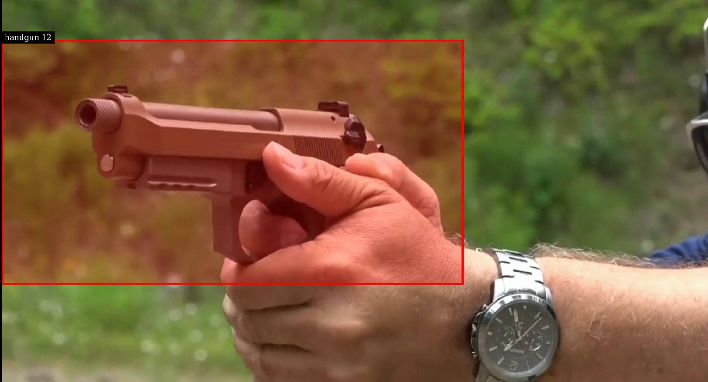
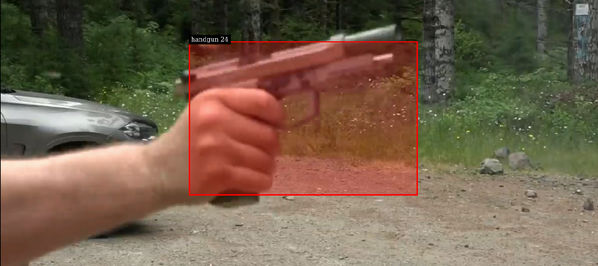
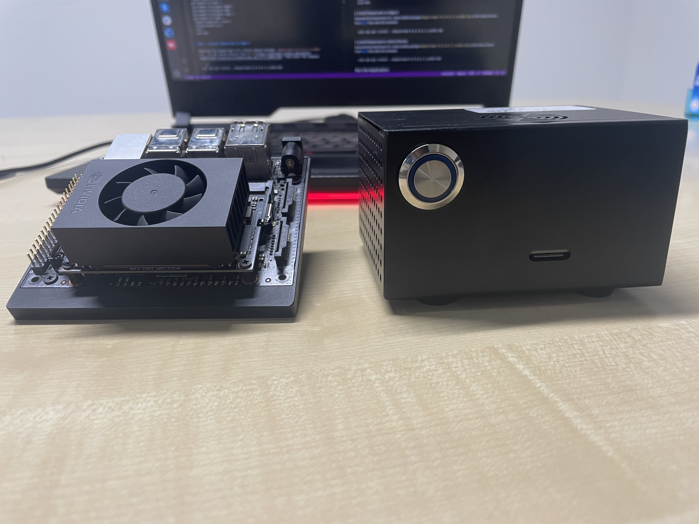

# Handgun Detection App

Armed robberies are a major concern all around the world, that can have serious repercussions. This app, built on Nvidia's Deepsteam SDK, which is a complete streaming analytics toolkit for AI-based multi-sensor processing, video and image understanding, helps individuals in early detection of Handguns during robberies, through CCTV footage. Post which, quick and appropirate action can be taken.





## Citations

* [AlexeyAB/darknet](https://github.com/AlexeyAB/darknet)
* [aj-ames/handgun-Deepstream](https://github.com/aj-ames/Hermes-Deepstream.git)

## Index

1. [Introduction](#Introduction)
2. [Deepstream Setup](#Deepstream-Setup)
    1. [Install System Dependencies](#Install-System-Dependencies)
    2. [Install Deepstream](#Install-Deepstream)
3. [Running the Application](#Running-the-Application)
    1. [Clone the repository](#Cloning-the-repository)
    2. [Run with different input sources](#Run-with-different-input-sources)

## Introduction

The Handgun Detection Application consists of a pipleline powered by Deepstream, that can be run on Nvidia power DGPU's as well as Jetson Devices such as the Jetson Xavier NX, Jeson Nano, Jetson Xavier AGX and the TX2.



## Deepstream Setup

This post assumes you have a fully functional Jetson device. If not, you can refer the documentation [here](https://docs.nvidia.com/jetson/jetpack/install-jetpack/index.html).

### 1. Install System Dependencies

```sh
sudo apt install \
libssl1.0.0 \
libgstreamer1.0-0 \
gstreamer1.0-tools \
gstreamer1.0-plugins-good \
gstreamer1.0-plugins-bad \
gstreamer1.0-plugins-ugly \
gstreamer1.0-libav \
libgstrtspserver-1.0-0 \
libjansson4=2.11-1
uuid \
uuid-dev
```

### 2. Install Deepstream on Dgpu's

Download the DeepStream 5.0.1 Debian package `deepstream-5.0_5.0.1-1_amd64.deb`, to the DGPU device from [here](https://developer.nvidia.com/assets/Deepstream/5.0/ga/secure/deepstream_sdk_5.0.1_amd64.deb). Then enter the command:

```sh
sudo apt-get install ./deepstream-5.0_5.0.1-1_amd64.deb
```

### 3. Install Deepstream in Jetson Devices

Download the deb file under - DeepStream 5.0.1 for Jetson from [here](https://developer.nvidia.com/deepstream-getting-started).

```sh
sudo apt-get install ./deepstream-5.0_5.0.1-1_arm64.deb
```

## Run the Application

### 1. Clone the repository

First, install git and git-lfs

```sh
sudo apt install git git-lfs
```

Next, clone the repository

```sh
# Using HTTPS
git clone https://github.com/varun299/deepstream-handgun-app.git
# Using SSH
git clone git@github.com:varun299/deepstream-handgun-app.git
```

Now, enable lfs and pull the yolo weights

```sh
git lfs install
git lfs pull
```

### 2. Run with different input sources

The computer vision part of the solution can be run on one or many input sources of multiple types, all powered using NVIDIA Deepstream.

Firstly, we must build the application by running the following command:

```sh
make clean && make -j$(nproc)
```

This will generate the binary called `handgun-app`. This is a one-time step and you need to do this only when you make source-code changes.

Next, create a file called `inputsources.txt` and paste the path of videos or rtsp url of CCTV IP cameras.

```sh
file:///home/iwiz2/Videos/handgun.mp4
```

Now, run the application by running the following command:

```sh
./handgun-app
```

Please find the Links to a couple of Demo videos, [here](https://youtu.be/FurARaN3zoY)

and [here](https://youtu.be/LG1fkwszkag)
